# Add & edit a guided answer — handoff

> Guided answers auto-surface a guide, guided tour, business-process agent, or custom message when a visitor's query matches an assigned list of trigger phrases. This handoff covers the two flows that manage that matching: the two-step Add-answer wizard and the tabbed Edit-answer dialog — including AI-assisted query generation from a written intent description. Table/list management (filters, delete, enable toggle, usage panel) is out of scope for this pass.
>
> _Captured from the standalone prototype at better-matching-guided-answer.vercel.app · repo czjakastonly/better-matching-guided-answer · commit dce3f30_

Markdown twin of the interactive handoff artifact (`artifact.html`).

## Entry point × actions

| Entry point | Add answer | Edit answer |
|---|---|---|
| **Table header (“Add new”)** | `instant` | — |
| **Row ⋯ menu (“Edit”)** | — | `instant` |

---

## Add a guided answer `instant`

_Trigger:_ Click “Add new” on the Guided answers table

> A 2-step sequential modal — nothing is saved until Step 2's “Add answer” commits.

| # | Phase | User → System | Screen |
|---|---|---|---|
| 1 | Guided answers | — → Answers table, ready to add one | 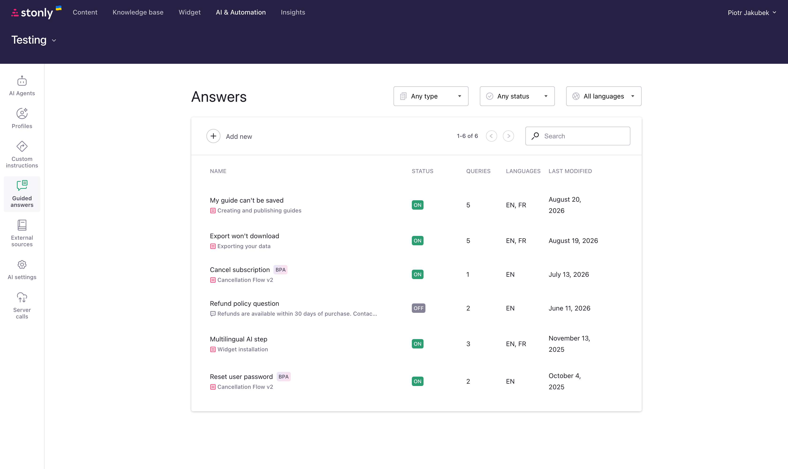 |
| 2 | Step 1 of 2 — Answer content | Clicks “Add new” → Opens the 2-step dialog | 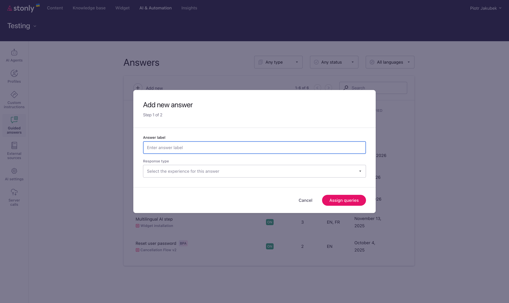 |
| 3 | Inline validation | Clicks “Assign queries” while empty → Shows required-field errors | 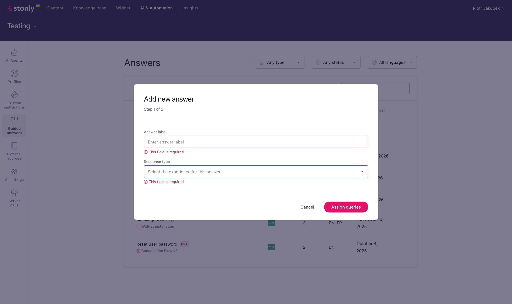 |
| 4 | Step 1 filled in | Names it, picks “Guide to load”, selects a guide → Guide + first-step start selected | 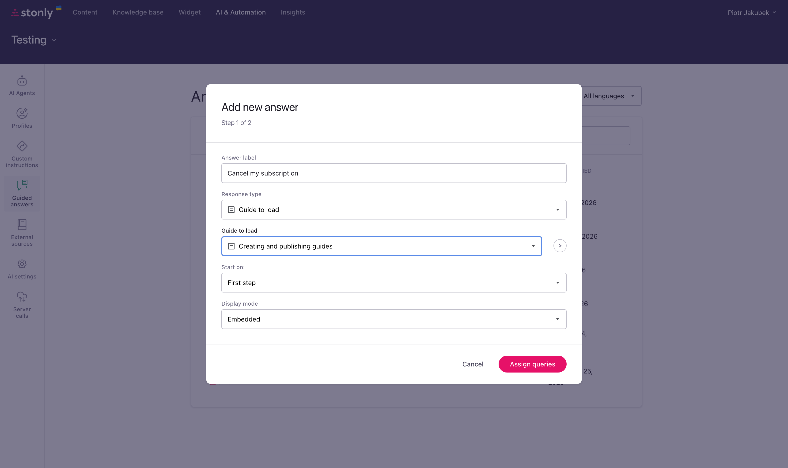 |
| 5 | Step 2 of 2 — Queries | Clicks “Assign queries” → Advances to Step 2, query list empty |  |
| 6 | Inline validation | Clicks “Add answer” with 0 queries → “Add at least one query” error | 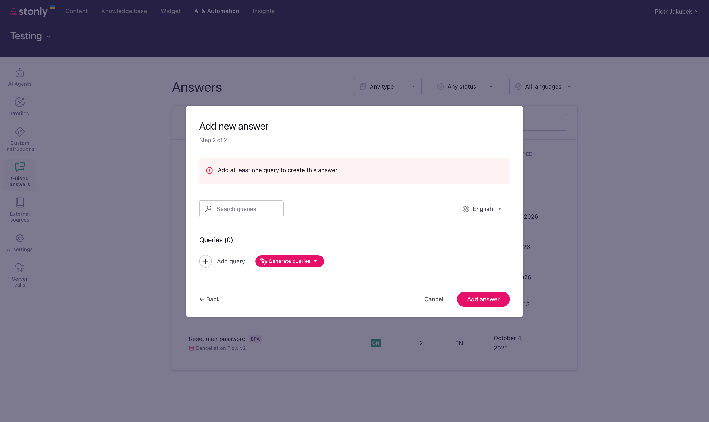 |
| 7 | Generate queries | Clicks “Generate queries” → Opens the intent-description popover | 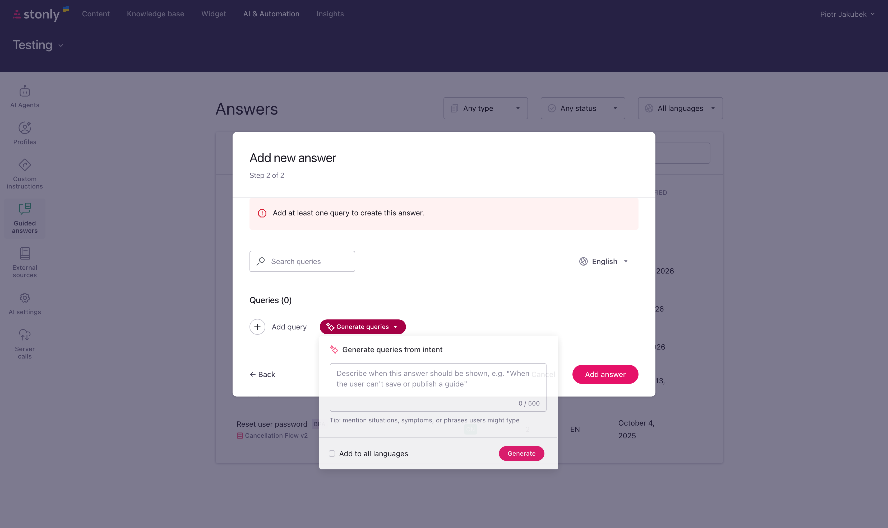 |
| 8 | Inline validation | Clicks “Generate” with the intent field empty → “The intent field cannot be empty.” shown | 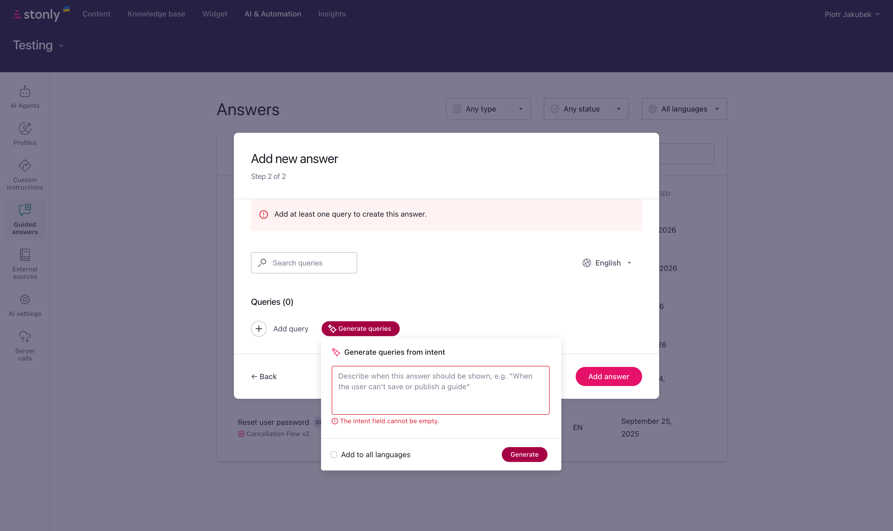 |
| 9 | Queries generated | Describes the intent, clicks “Generate” → Suggested queries appended + highlighted | 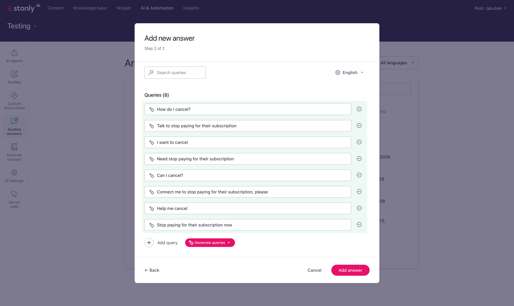 |
| 10 | Manual & edited queries | Edits a generated query's text, and manually adds another → Both read with the pen icon — a query stays AI-tagged only while unedited | 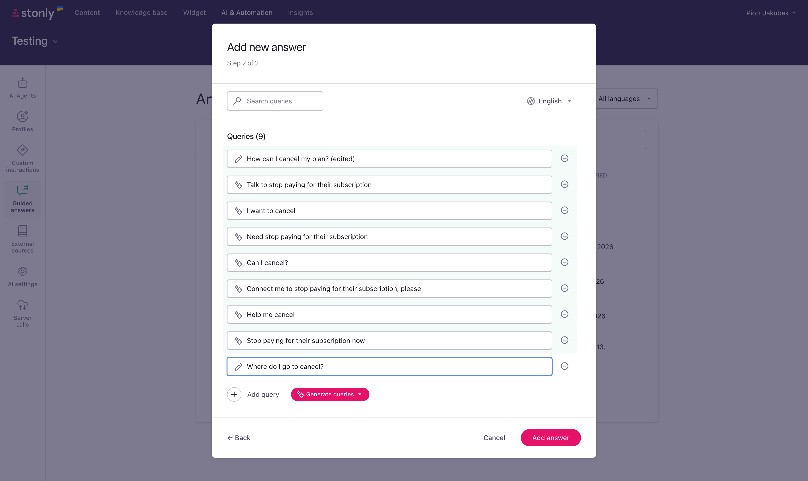 |
| 11 | Switch language | Switches the language selector to French → French has no queries yet — each language starts empty until typed or generated | 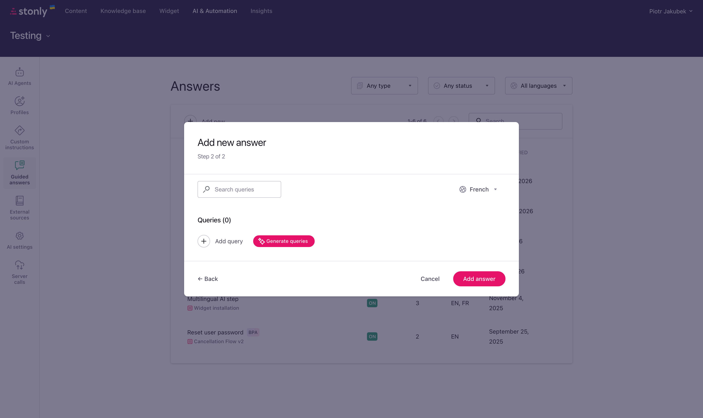 |
| 12 | Generate for French only | Describes the intent again, generates without checking “Add to all languages” → Only French gets new queries — English is untouched | 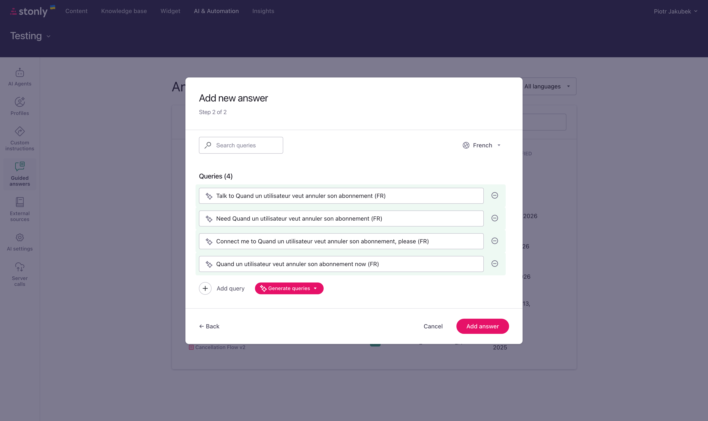 |
| 13 | Search filters the list | Types a term that matches nothing into the search field → Empty-state illustration replaces the row list; the “+ Add query”/“Generate queries” actions stay reachable and clear the filter automatically | 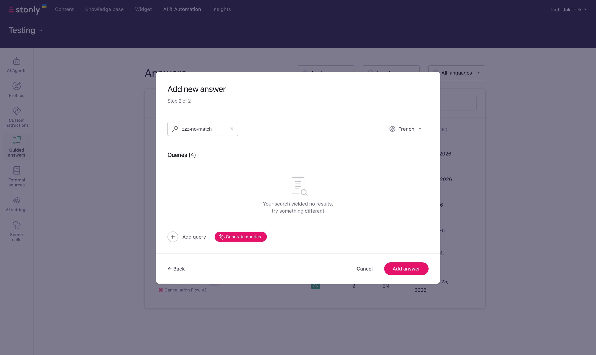 |
| 14 | Answer added | Clicks “Add answer” → Dialog closes, new row appears in the table | 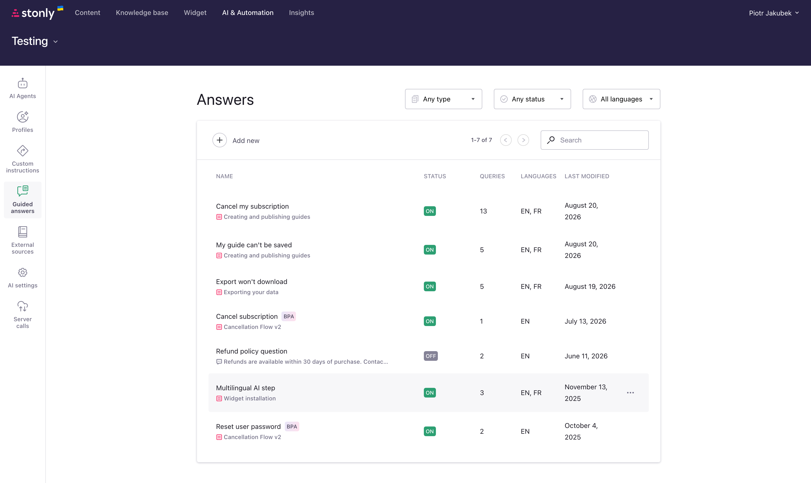 |
| 15 | Exit without saving? | Clicks “Cancel” with unsaved content → Confirms before discarding | 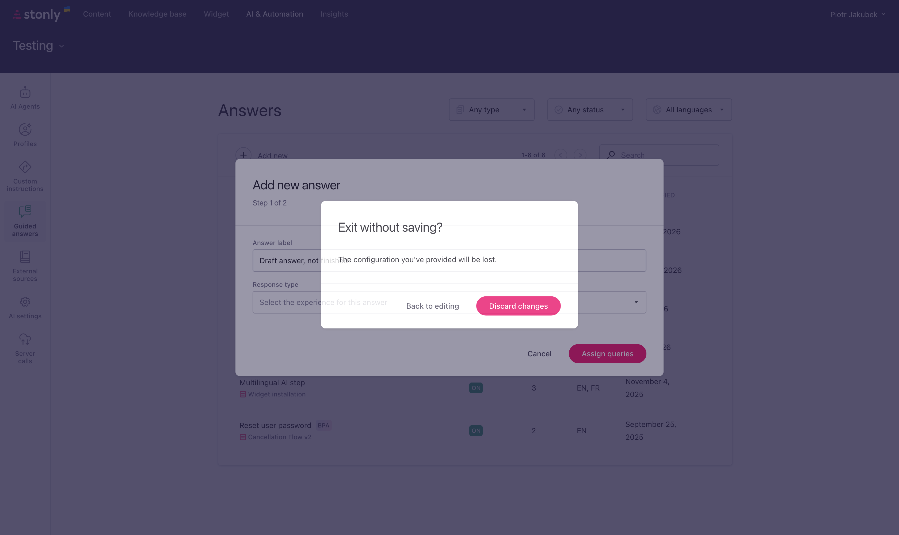 |
| 16 | Discarded | Clicks “Discard changes” → Dialog closes, nothing was saved | 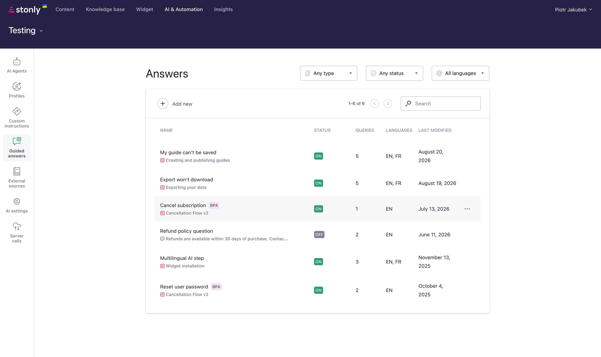 |

**Use case** — *Actor:* Team Admin. *Goal:* Create a new guided answer that auto-triggers a guide, tour, business-process agent, or custom message for matching visitor queries. *Pre:* Team Admin is on the Guided answers screen. *Main:* Admin clicks “Add new” → Admin names the answer and picks a response type (guide, custom message, or business-process agent) → For a guide/BPA type, admin picks the guide and, optionally, its start step → Admin clicks “Assign queries” to advance to Step 2 → Admin types queries manually and/or generates them from a written intent description → Admin clicks “Add answer”. *Alt:* “Generate queries” opens a popover; describing an intent and clicking “Generate” appends several AI-suggested phrasings for the current language only, unless “Add to all languages” is checked; “Add to all languages” only appears once the answer has more than one language (inherited from the selected guide, or from a custom message with a 2nd language added) — a single-language answer's popover omits it, since there's nothing else to batch into; Each language keeps its own query list — switching the language selector to one nothing has been typed/generated for yet shows it empty; generating there fills in just that language; Manually-typed and AI-generated queries share one list; a query only reads as AI-generated (sparkle icon) while its text still matches what was generated — editing it, or typing one from scratch via “+ Add query”, shows the pen icon instead; Searching the query list by text swaps the row list for an empty-state illustration when nothing matches; adding or generating a query while a filter is active clears it automatically so the new row is never hidden. *Exc:* Advancing to Step 2 with required Step-1 fields empty shows inline validation instead of navigating; Submitting Step 2 with zero queries shows “Add at least one query to create this answer.”; Clicking “Generate” with the intent field empty shows “The intent field cannot be empty.” instead of generating; Cancelling with unsaved content prompts an exit-confirmation dialog. *Post:* A new row appears in the Guided answers table, enabled by default.

## Edit a guided answer `instant`

_Trigger:_ Open a row's ⋯ menu → Edit

> A single tabbed modal — Answer / Queries / Settings — sharing its Queries UI and Generate-queries engine with the Add-answer flow.

| # | Phase | User → System | Screen |
|---|---|---|---|
| 1 | Row menu | Opens a row's ⋯ menu → Shows Edit / Enable / Delete | 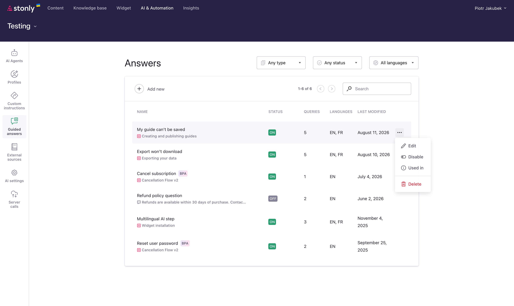 |
| 2 | Edit — Answer tab | Clicks “Edit” → Opens the tabbed dialog, fields prefilled | 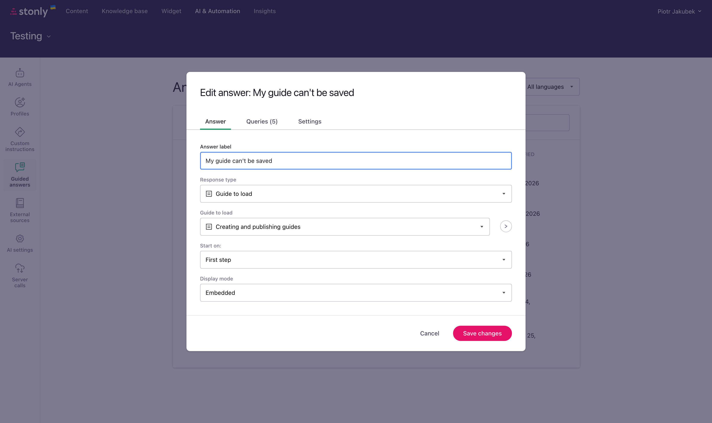 |
| 3 | Inline validation | Clears the name, clicks “Save changes” → “This field is required” shown | 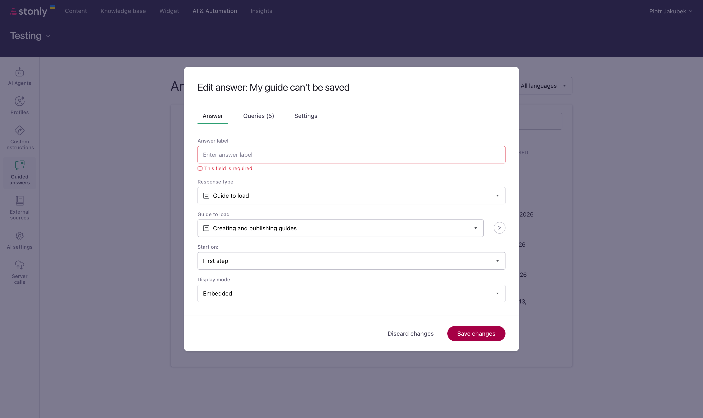 |
| 4 | Queries tab | Switches to the Queries tab → Existing per-language queries load (a language nothing was ever added to shows empty) | 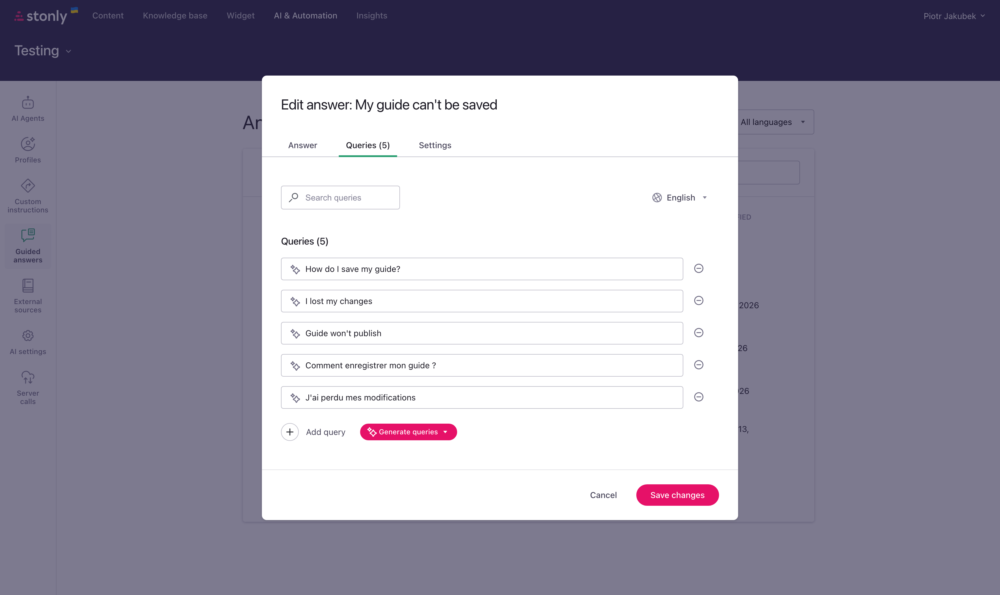 |
| 5 | Generate more queries | Describes a new intent, generates → New queries appended + highlighted, tagged AI until edited (then pen icon, same as manual) | 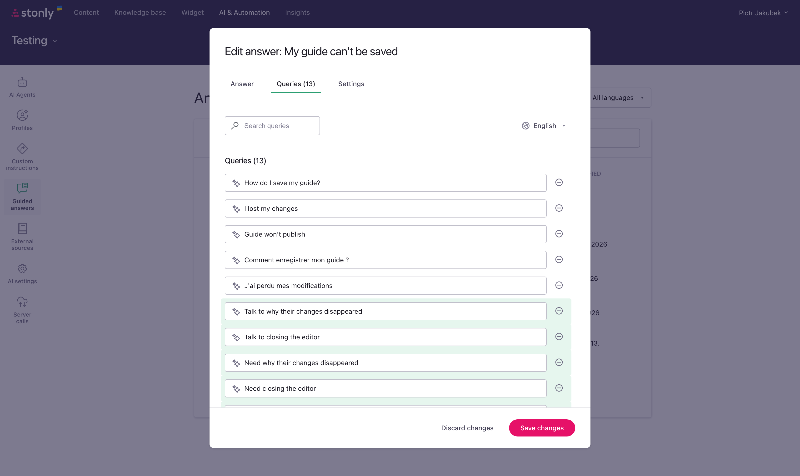 |
| 6 | Settings tab | Switches to the Settings tab → Custom loading message field | 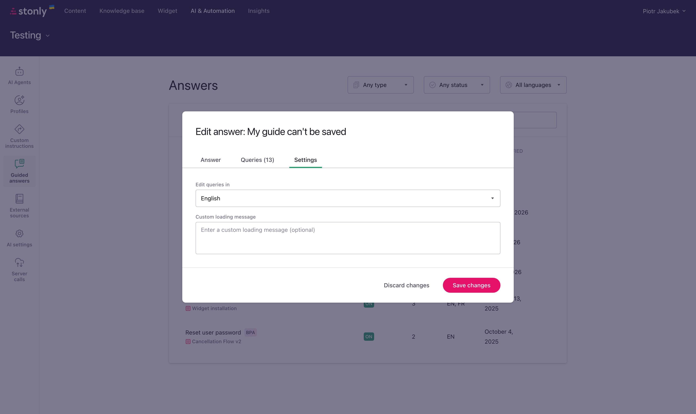 |
| 7 | Changes saved | Clicks “Save changes” → Dialog closes, row updates in place | 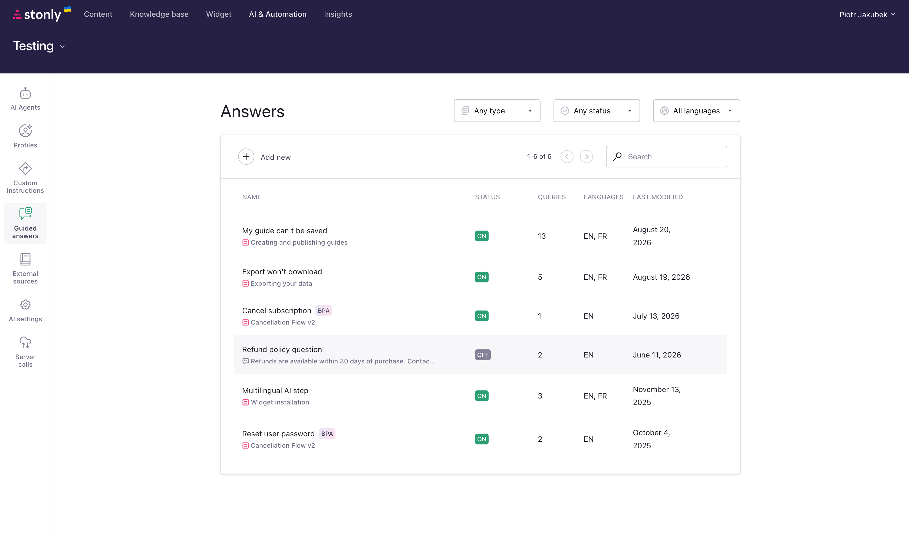 |
| 8 | Exit without saving? | Edits the name, clicks “Discard changes” → Confirms before discarding | 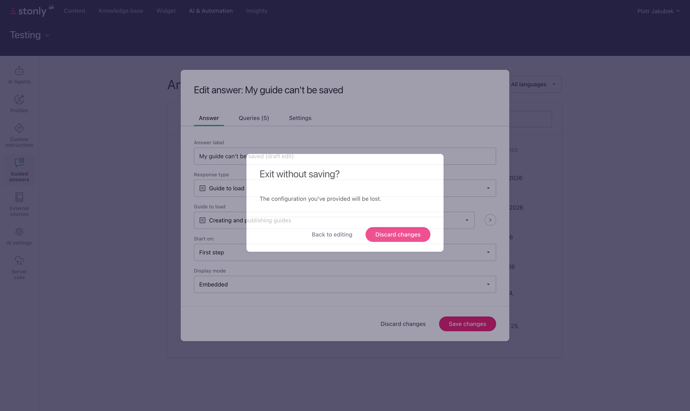 |
| 9 | Discarded | Clicks “Discard changes” → Dialog closes, row unchanged | 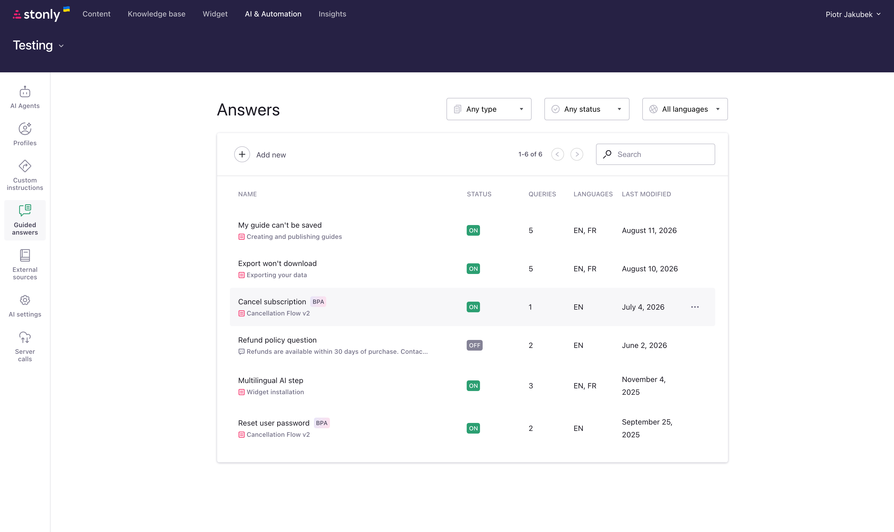 |

**Use case** — *Actor:* Team Admin. *Goal:* Update an existing guided answer's content, queries, or settings. *Pre:* At least one guided answer exists in the table. *Main:* Admin opens a row's ⋯ menu and clicks “Edit” → Admin adjusts fields on the Answer tab → Admin reviews or edits queries on the Queries tab, generating more if needed → Admin adjusts the Settings tab (custom loading message) where applicable → Admin clicks “Save changes”. *Alt:* Existing queries are fetched per language on demand as the language selector changes; a language with nothing added yet just shows an empty list; Unsaved additions (e.g. from Generate) survive a language re-fetch; Same generate/manual/language rules as Add — see the Add-answer flow for the full walkthrough (edit-to-manual icon flip, per-language generation, “Add to all languages” only with 2+ languages). *Exc:* Clearing the required name field and saving triggers inline validation instead of closing; Cancelling with changes prompts “Exit without saving?”. *Post:* The row's values, query count, and “last modified” date update in place.

---

## Component blueprints

Measured from the rendered DOM → resolved to tokens.

**Answer settings** — `AnswerSettings.tsx` · uses `InputText`, `InputSelect`, `InputDropdown`, `GuideFinder`

| Element | Property | Measured | Token |
|---|---|---|---|
| Container | text | `#1c1a24` | `color.iconHover` |
| Container | type | `16/400/auto` | — |
| Answer label | text | `#1c1a24` | `color.iconHover` |
| Answer label | type | `14/400/20` | `type.uiElement` |
| Answer label | padding | `10px 12px` | — |
| Response type | text | `#000000` | `(no token)` |
| Response type | type | `13/400/auto` | — |
| Response type | radius | `4px` | `radius.md` |
| Guide to load | text | `#000000` | `(no token)` |
| Guide to load | type | `13/400/auto` | — |
| Guide to load | radius | `4px` | `radius.md` |
| Assign queries (primary) | background | `#e61168` | `color.backgroundPrimary` |
| Assign queries (primary) | text | `#ffffff` | `color.backgroundDefault` |
| Assign queries (primary) | type | `14/500/20` | `type.uiElementStrong` |
| Assign queries (primary) | radius | `18px` | `radius.pill` |
| Assign queries (primary) | padding | `7px 15px` | — |
| Assign queries (primary) | border | `1px #e61168` | `color.backgroundPrimary` |
| Cancel (secondary) | text | `#474459` | `color.textDefault` |
| Cancel (secondary) | type | `14/500/20` | `type.uiElementStrong` |
| Cancel (secondary) | radius | `18px` | `radius.pill` |
| Cancel (secondary) | padding | `7px 15px` | — |
| Cancel (secondary) | border | `1px transparent` | — |

**Queries panel** — `QueriesSettings.tsx` · uses `InputSearch`, `LanguageSelector`, `InputTextarea`, `ButtonAdd`, `GenerateQueriesDropdown`

| Element | Property | Measured | Token |
|---|---|---|---|
| Container | text | `#1c1a24` | `color.iconHover` |
| Container | type | `16/400/auto` | — |
| Search queries | text | `#1c1a24` | `color.iconHover` |
| Search queries | type | `14/400/24` | `type.paragraph1` |
| Search queries | radius | `4px` | `radius.md` |
| Search queries | padding | `0px 12px` | — |
| Search queries | gap | `12px` | — |
| Search queries | border | `1px #c1c0cb` | `color.iconSubtle` |
| Language selector | text | `#474459` | `color.textDefault` |
| Language selector | type | `14/500/20` | `type.uiElementStrong` |
| Language selector | radius | `18px` | `radius.pill` |
| Language selector | padding | `7px 15px` | — |
| Language selector | border | `1px transparent` | — |
| Queries (section, count) | text | `#1c1a24` | `color.iconHover` |
| Queries (section, count) | type | `16/500/24` | `(no token)` |
| Query row — AI-generated (sparkle) | background | `#ddf3e8` | `(no token)` |
| Query row — AI-generated (sparkle) | text | `#1c1a24` | `color.iconHover` |
| Query row — AI-generated (sparkle) | type | `14/400/24` | `type.paragraph1` |
| Query row — AI-generated (sparkle) | radius | `4px` | `radius.md` |
| Query row — AI-generated (sparkle) | padding | `8px 8px` | — |
| Query row — AI-generated (sparkle) | gap | `8px` | — |
| Query row — manual/edited (pen) | text | `#1c1a24` | `color.iconHover` |
| Query row — manual/edited (pen) | type | `14/400/24` | `type.paragraph1` |
| Query row — manual/edited (pen) | radius | `4px` | `radius.md` |
| Query row — manual/edited (pen) | padding | `8px 8px` | — |
| Query row — manual/edited (pen) | gap | `8px` | — |
| Add query | text | `#474459` | `color.textDefault` |
| Add query | type | `14/400/auto` | — |
| Add query | radius | `16px` | `(no token)` |
| Add query | gap | `12px` | — |
| Generate queries | background | `#e61168` | `color.backgroundPrimary` |
| Generate queries | text | `#ffffff` | `color.backgroundDefault` |
| Generate queries | type | `12/500/16` | `type.uiElementLabel` |
| Generate queries | radius | `18px` | `radius.pill` |
| Generate queries | padding | `5px 11px` | — |
| Generate queries | border | `1px #e61168` | `color.backgroundPrimary` |

**Generate-queries popover** — `GenerateQueriesDropdown.tsx` · uses `Popover`, `InputTextarea`, `FieldCheck`, `ButtonPrimary`

| Element | Property | Measured | Token |
|---|---|---|---|
| Container | background | `#ffffff` | `color.backgroundDefault` |
| Container | text | `#1c1a24` | `color.iconHover` |
| Container | type | `16/400/auto` | — |
| Container | radius | `4px` | `radius.md` |
| Container | shadow | `elevation` | `(custom)` |
| Intent description | text | `#1c1a24` | `color.iconHover` |
| Intent description | type | `14/400/20` | `type.uiElement` |
| Intent description | padding | `8px 12px 22px 12px` | — |
| Generate (primary) | background | `#e61168` | `color.backgroundPrimary` |
| Generate (primary) | text | `#ffffff` | `color.backgroundDefault` |
| Generate (primary) | type | `12/500/16` | `type.uiElementLabel` |
| Generate (primary) | radius | `18px` | `radius.pill` |
| Generate (primary) | padding | `5px 11px` | — |
| Generate (primary) | border | `1px #e61168` | `color.backgroundPrimary` |

**Exit-without-saving dialog** — `ActionsDialog.tsx (exit-confirmation variant)` · uses `ActionsDialog`

| Element | Property | Measured | Token |
|---|---|---|---|
| Component | background | `#ffffff` | `color.backgroundDefault` |
| Component | text | `#1c1a24` | `color.iconHover` |
| Component | type | `16/400/auto` | — |
| Component | radius | `8px` | `radius.lg` |
| Component | shadow | `elevation` | `(custom)` |

---

## Icons

13 glyphs in `docs/handoff/guided-answers/icons`. The interactive artifact offers per-icon download / copy source / copy JSX.

